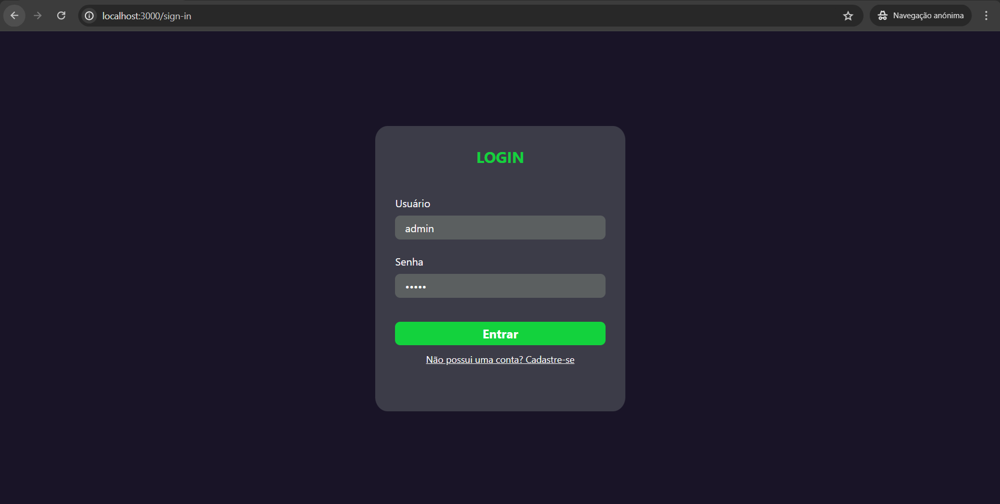
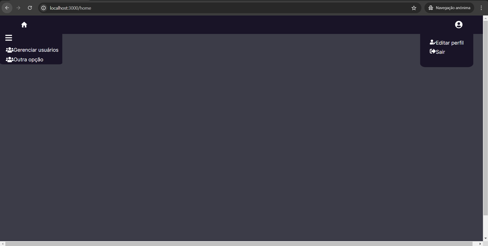
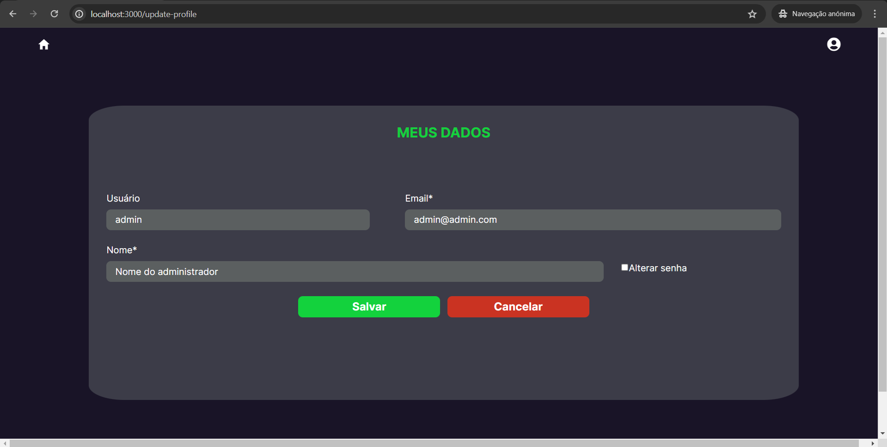
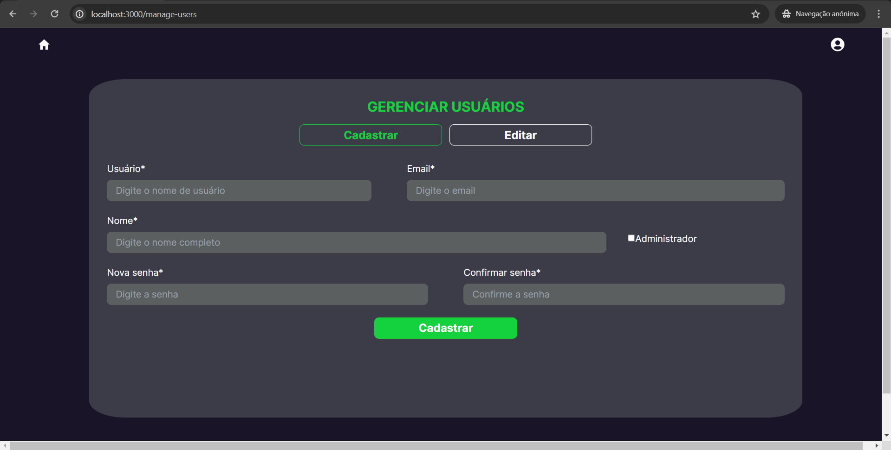
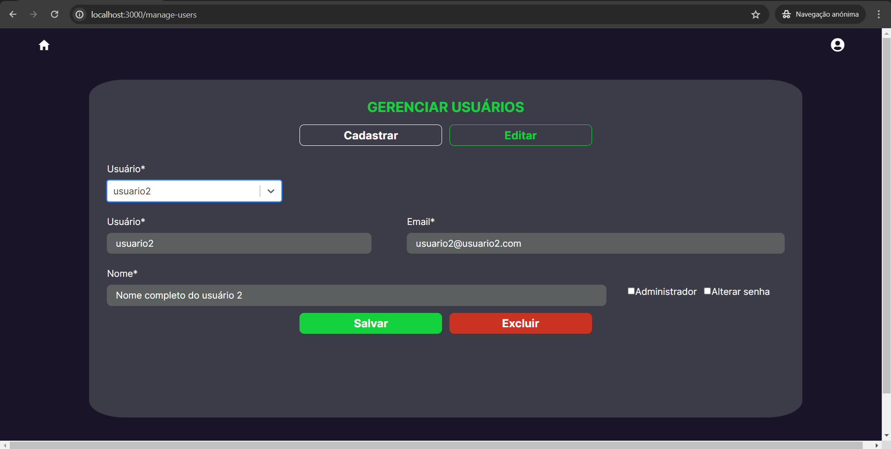

# Controle de Acesso

## Descrição

Sistema de nível de controle de acesso (ACL) baseado em <i>roles</i> usando Node.js e Express.

A implementação será realizada com base no conteúdo disponível <a href="https://medium.com/@pedro.lg.cs/implementando-controle-de-acesso-acl-no-nodejs-com-express-ef3a4d5bddf0">aqui</a>.

O sistema de autorização será baseado em dois papéis (<i>roles</i>): <i>admin</i> e <i>auth</i>. O <i>admin</i> poderá acessar todas as rotas da aplicação (e.g. fazer CRUD de usuário com base no username), enquanto que o <i>auth</i> poderá acessar somente as rotas que exigem apenas a autenticação (e.g. fazer o CRUD do próprio perfil).

## Requisitos Funcionais

| Identificador | Descrição                                                  |
| ------------- |:-----------------------------------------------------------|
| RF01          | CRUD do próprio perfil (comum e admin)                     |
| RF02          | CRUD de perfil com base no username (admin)                |
| RF03          | Fazer login/logout (comum e admin)                         |

## Stack de desenvolvimento
### Para o backend:
<ol>
    <li>Node.js;</li>
    <li>Postgres, para a persistência de dados;</li>
    <li>Postman, para o teste das rotas.</li>
</ol>

### Para o frontend:
<ol>
    <li>React.js;</li>
    <li>Nest.js;</li>
    <li>Typescript.</li>
</ol>

## Atualizações Futuras
<ul>
    <li>Melhorar responsividade do site (algumas telas não apresentam visualização adequada em dispositivos menores);</li>
    <li>Permitir que usuário altere idioma do site pelo menos entre português e inglês (atualmente as mensagens retornadas pelo backend estão em inglês e o frontend está em português);</li>
    <li>Integrar sistema de login com autenticação pelo google ou facebook, por exemplo.</li>
</ul>

## Resultado Final - Overview
✔️ Login

✔️ Home (administrador)

✔️ Atualização do perfil do usuário logado

✔️ Gerenciamento de usuários - cadastro (administrador)

✔️ Gerenciamento de usuários - atualização/deleção (administrador)
